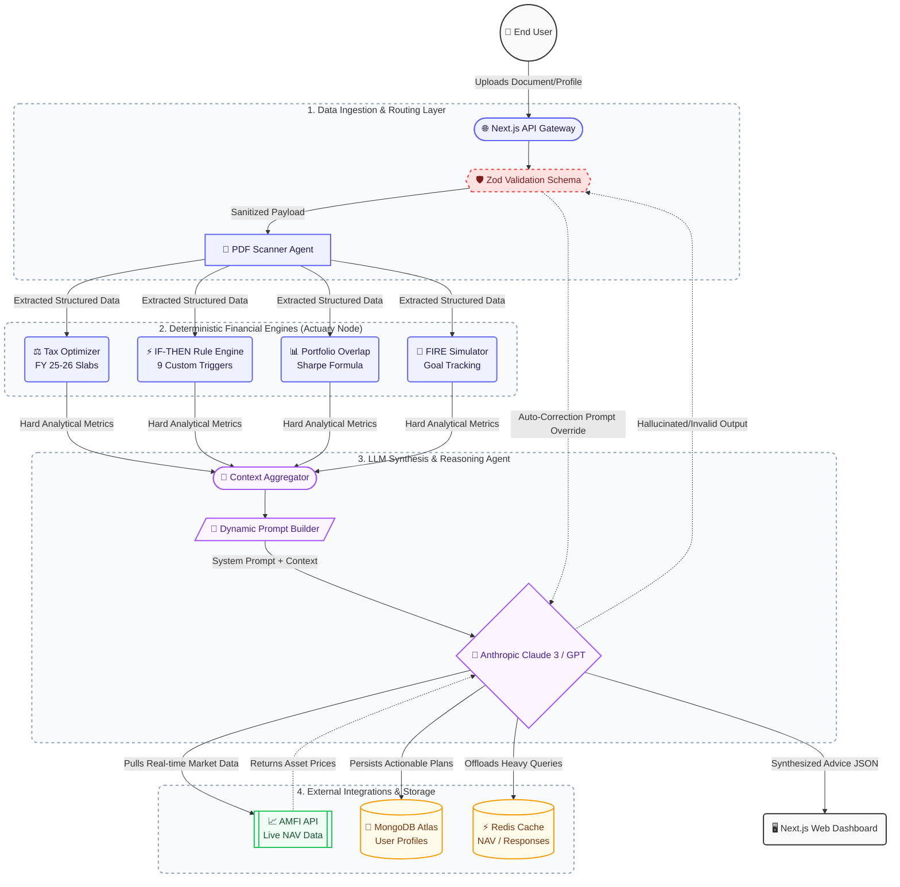

# AI Money Mentor: System Architecture & Agent Workflow

## 1. High-Level Architecture Diagram
The architecture is designed to orchestrate document parsing, deterministic financial engines, and AI-driven personalization, ensuring robust, scalable, and secure wealth management.

## 2. Agent Roles and Responsibilities
The system orchestrates a set of specialized modules acting as internal "agents," coordinated by the main AI orchestrator (Anthropic Claude).

**1. Data Extraction Agent:**
- **Role:** Ingests raw user inputs (Form 16 PDFs, manual wizard inputs).
- **Function:** Parses unstructured data, categorizes income, detects 80C/80D deductions, and normalizes it into a standard JSON schema.

**2. Deterministic Engines (The "Actuaries"):**
- **Tax Engine:** Strictly computes exact mathematical liability based on FY 2025-26 Indian Tax Slabs.
- **Rule Engine:** Fires deterministic IF-THEN triggers (e.g., if insurance cover is 0, recommend term policy of 15x income).
- **Portfolio Analyst:** Calculates overlapping fund holdings using the mathematical Sharpe Overlap formula.
- **Why?** Deterministic math cannot be trusted to large language models alone because LLMs hallucinate numbers. These engines provide hard truth.

**3. Synthesis & Recommendation Agent (Claude 3 / GPT-4):**
- **Role:** Translates raw calculations into personalized, conversational, and actionable insights.
- **Input:** Aggregated output from the deterministic engines.
- **Output:** Structured JSON containing customized financial advice, severity ratings, explanation text, and next steps with expected financial impacts.

## 3. Communication Pathways
- **Client to Server:** REST API via Next.js route handlers (`/api/analyze`), passing structured JSON or multiparty forms (documents).
- **Inter-Engine:** All engines are strictly typed via TypeScript and communicate through synchronized function calls inside the `/api/analyze` controller. 
- **Agent to External APIs:** The backend communicates with AMFI for real-time Mutual Fund NAVs using direct HTTP fetches. The Agent communicates with the LLM API (Anthropic or OpenAI) using specific system instructions enforcing raw JSON output.

## 4. Tool Integrations
- **Anthropic Claude / OpenAI:** Primary natural language reasoning and insight generation.
- **AMFI API:** Pulled via GET request to fetch the latest Mutual Fund NAVs. Responses are aggressively cached to prevent rate-limiting.
- **MongoDB Atlas:** User profiles, states, and history logs are synced natively via Mongoose.
- **Vercel Cron Jobs:** Background polling to update the secondary systems like daily NAV fetches.

## 5. Error-Handling Logic
The platform embraces an aggressive fallback strategy:

1. **Input Sanitization (Zod Layer):** All inbound requests are checked. If an array expects numbers but receives strings, it rejects early and returns a `400 Bad Request`.
2. **AI Payload Validation:** Upon receiving the AI's response, it is validated against a rigorous Zod schema. 
    - *If parsing fails:* The system automatically strips markdown wrappers (e.g., `\`\`\`json`).
    - *If structure is invalid:* The system either retries the API call (up to 2 times) or gracefully falls back to a "safe-mode" preset of simple recommendations directly triggered by the local Rule Engine (bypassing the AI to avoid a fatal crash for the user).
3. **API Timeouts:** Upstream timeouts from AMFI or Anthropic trigger cached or simulated placeholder data to ensure the UI successfully renders without hanging indefinitely.
4. **Rate Limit Defense:** Requests exceeding 20 req/min/IP trigger an HTTP `429 Too Many Requests` response from the Next.js edge middleware, blocking malicious spam before it incurs API costs.
